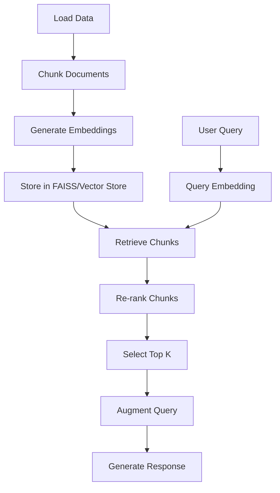

# 📚 Retrieval-Augmented Generation (RAG)

## 🧠 Introduction

**Retrieval-Augmented Generation (RAG)** is an advanced architecture that combines information retrieval with natural language generation. Introduced by Facebook AI in 2020, RAG enhances the performance of language models by allowing them to fetch relevant external knowledge to assist in generating more accurate, factual, and context-aware responses.

Unlike traditional language models that rely solely on pre-trained parameters, RAG dynamically retrieves information from a knowledge source (e.g., a document store, Wikipedia, or any custom database) during inference.

---

## 🏗️ Architecture Overview

The RAG architecture is composed of two primary modules:

1. **Retriever** (e.g., DPR - Dense Passage Retriever)
2. **Generator** (e.g., BART, T5)

The flow of RAG can be summarized as:


---

## 🔧 Components

### 1. Retriever
- Responsible for fetching relevant documents based on the input query.
- Common implementations:
  - **DPR (Dense Passage Retrieval)**: Uses two BERT-based encoders (query and passage encoders).
  - **BM25 / ElasticSearch**: Keyword-based sparse retrieval.
- Outputs the top-K most relevant documents or passages.

### 2. Generator
- A sequence-to-sequence model like **BART** or **T5**.
- Takes the original query along with each retrieved document to generate an answer.
- Can operate in two modes:
  - **RAG-Sequence**: Generates one answer per retrieved document, then selects the best.
  - **RAG-Token**: Considers all retrieved documents jointly to generate each token.

---

## 🔁 Workflow

1. **Input Query** is passed to the retriever.
2. **Retriever** searches a large document corpus and fetches top-K documents.
3. For each document:
   - Concatenate with the query: `[query] + [document]`.
4. Pass concatenated input into the **Generator** model.
5. Generate the output sequence (answer).
6. Optionally, aggregate results (e.g., reranking or averaging token probabilities).

---

## ✨ Benefits

- **Dynamic Knowledge Access**: Access up-to-date or domain-specific information.
- **Reduced Hallucination**: More grounded in factual data.
- **Scalable**: Can be updated by simply updating the document store, without retraining the model.
- **Flexible**: Can be integrated with various retrieval and generation models.

---

## ⚠️ Challenges

- **Retrieval Quality**: The final generation is only as good as the retrieved documents.
- **Latency**: Retrieving documents and generating responses adds inference time.
- **End-to-End Training**: Joint training of retriever and generator is complex.
- **Memory & Storage**: Storing large vector indexes can be resource-intensive.

---

## 🧪 Use Cases

- **Question Answering (QA)**
- **Chatbots with external knowledge**
- **Document summarization with context**
- **Domain-specific assistants (legal, medical, etc.)**

---

## 🛠️ Popular Tools & Libraries

- **Hugging Face Transformers**
  - `RagRetriever`, `RagTokenizer`, `RagSequenceForGeneration`
- **Haystack** by deepset
- **LangChain**: Modular framework for building LLM applications with retrieval.

---

## 📎 Example Code (Hugging Face Transformers)

```python
from transformers import RagTokenizer, RagRetriever, RagSequenceForGeneration

tokenizer = RagTokenizer.from_pretrained("facebook/rag-sequence-nq")
retriever = RagRetriever.from_pretrained("facebook/rag-sequence-nq", use_dummy_dataset=True)
model = RagSequenceForGeneration.from_pretrained("facebook/rag-sequence-nq", retriever=retriever)

question = "What is the capital of France?"
input_dict = tokenizer.prepare_seq2seq_batch([question], return_tensors="pt")
generated = model.generate(input_ids=input_dict["input_ids"])

print(tokenizer.batch_decode(generated, skip_special_tokens=True))
```
### 📦 Chunking Strategies

| Strategy                  | Description                                                                 | Pros                                               | Cons                                               | Best For                                      |
|---------------------------|-----------------------------------------------------------------------------|----------------------------------------------------|----------------------------------------------------|------------------------------------------------|
| Fixed-size Chunking       | Divides text into equal-sized tokens (e.g., 512 tokens)                     | Simple, fast                                       | May break context or semantics                    | Generic use cases, small documents            |
| Sliding Window            | Overlapping chunks to preserve context between splits                       | Retains context continuity                         | Increased number of chunks, redundancy             | Conversational context, QA systems            |
| Sentence-based            | Splits at sentence boundaries                                               | Preserves meaning and grammar                      | Uneven chunk sizes                                 | NLP tasks sensitive to semantics              |
| Paragraph-based           | Chunks by paragraphs                                                        | Preserves context and structure                    | May exceed token limits                            | Summarization, retrieval-heavy tasks          |
| Semantic Chunking         | Uses NLP models to chunk by meaning                                         | Context-aware, intelligent                         | Computationally expensive                          | High-accuracy applications                    |
| Title + Content Chunking  | Adds metadata like titles with chunks                                       | Boosts retrieval relevance                         | Requires structured input                          | Docs with headings (e.g., Markdown, HTML)     |


### 🧩 Indexing Strategies

| Strategy           | Description                                                    | Pros                                              | Cons                                             | Best For                                 |
|--------------------|----------------------------------------------------------------|---------------------------------------------------|--------------------------------------------------|--------------------------------------------|
| Flat Index         | Brute-force search using raw vectors                          | Simple, accurate                                  | Slow for large datasets                          | Small document stores                     |
| FAISS (Flat/IVF)   | Facebook AI’s similarity search library using ANN techniques  | Fast, scalable, tunable trade-off between speed & accuracy | Setup complexity                             | Large corpora, vector DBs                 |
| HNSW               | Hierarchical Navigable Small World graphs for ANN             | Very fast and efficient                           | Memory intensive                                | Real-time search, mid-sized collections   |
| Inverted Index     | Keyword-based indexing (e.g., ElasticSearch, BM25)            | Fast, interpretable                               | Struggles with semantic matching                | Structured content, keyword search        |
| Hybrid Index       | Combines dense (vectors) and sparse (keywords) methods        | Best of both worlds                               | Increased complexity                            | Semantic + lexical retrieval              |
| Disk-based Index   | Stores large indexes on disk instead of RAM                   | Memory efficient                                  | Slower than in-memory methods                   | Resource-constrained environments         |

### 🔍 Retrieval Methods

| Method              | Description                                                          | Pros                                        | Cons                                           | Best For                                  |
|---------------------|----------------------------------------------------------------------|---------------------------------------------|------------------------------------------------|--------------------------------------------|
| Sparse Retrieval    | Uses keyword-based methods like BM25 or TF-IDF                      | Fast, interpretable, no training needed     | Ignores semantics                             | Traditional IR, legal/technical search    |
| Dense Retrieval     | Uses embeddings (e.g., DPR, Sentence-BERT)                          | Semantic understanding, better relevance    | Requires vector search infra                  | Conversational AI, semantic search        |
| Hybrid Retrieval    | Combines sparse and dense scores                                    | Improved recall and precision               | More complex infrastructure                   | Open-domain QA, production systems        |
| Metadata Filtering  | Filters docs by tags or attributes before retrieval                 | Efficient narrowing of search space         | Depends on structured metadata                | Domain-specific search                    |
| Multi-vector (ColBERT)| Uses multiple embeddings per document for fine-grained matching     | High recall and fine-grained matching       | Storage intensive                             | Large-scale QA, precision search          |
| Reranking           | Retrieves top-K and then reranks using a cross-encoder or LLM       | Boosts final quality                        | Slower, expensive                             | High-accuracy applications                |
| LLM-as-a-Retriever  | Uses LLM itself to fetch or generate from memory                    | Flexible, no external index                 | Costly, black-box behavior                    | Prototypes, few-shot scenarios            |


### 🔍 Latency Optimization

- RAG can be slow, but you can optimize:
- Use approximate nearest neighbor (ANN) search (e.g., FAISS, HNSW).
- Batch queries to the retriever.
- Use caching for frequent queries.
- Apply asynchronous retrieval (in streaming systems).

### Hallucination is a risk:
- Display sources with generated answers ("source attribution").
- Use fact-checking models or post-processing.
- Tune the generation temperature to reduce hallucinations.
- Encourage citations in the prompt: "Based on the retrieved document..."

## 📊 Evaluation Metrics for RAG

Evaluating RAG involves assessing three key components:
1. **Retriever Performance**
2. **Generator Performance**
3. **End-to-End Task Accuracy**

---

### 1️⃣ Retriever Metrics

| Metric         | Description                                                                 | Type       | Notes                                           |
|----------------|-----------------------------------------------------------------------------|------------|--------------------------------------------------|
| **Recall@K**   | Measures how often the correct document is among the top-K retrieved.       | Quantitative | Higher is better (commonly K=5, 10, 20).         |
| **Precision@K**| Fraction of retrieved docs that are relevant.                              | Quantitative | Not always used alone (less informative).        |
| **MRR (Mean Reciprocal Rank)** | Avg of 1/rank of the first relevant document.                   | Ranking     | Sensitive to position of relevant result.        |
| **Hit@K**      | Binary: Was a relevant doc in top-K?                                        | Binary      | Simplified form of Recall@K.                     |
| **nDCG@K**     | Normalized Discounted Cumulative Gain; weights relevant docs by position.   | Ranking     | Rewards high-ranked relevant docs.               |
| **Embedding Similarity** | Cosine similarity between query and document embeddings.           | Internal    | Useful for debugging, not always meaningful.     |

---

### 2️⃣ Generator Metrics

| Metric        | Description                                                               | Type        | Notes                                                |
|---------------|---------------------------------------------------------------------------|-------------|------------------------------------------------------|
| **BLEU**      | Compares n-grams of output to references.                                 | N-gram Overlap | Good for short, factual outputs.                     |
| **ROUGE (ROUGE-1/2/L)** | Recall-Oriented; compares n-grams and longest common subsequences. | N-gram Overlap | Common in summarization.                            |
| **BERTScore** | Uses pre-trained BERT embeddings to measure semantic similarity.          | Semantic     | Better than BLEU/ROUGE for paraphrased outputs.      |
| **METEOR**    | Considers synonymy, stemming, and paraphrasing.                          | N-gram/Align | Good complement to BLEU and ROUGE.                   |
| **GPTScore / LLMScore** | Uses another LLM to judge quality or factuality.                  | LLM-based    | Expensive, but closer to human judgment.             |
| **Average Log-Likelihood** | Measures model confidence in generating output.                   | Internal     | Helpful during fine-tuning.                          |

---

### 3️⃣ End-to-End Metrics (QA / RAG Pipeline)

| Metric         | Description                                                                 | Notes                                         |
|----------------|-----------------------------------------------------------------------------|-----------------------------------------------|
| **Exact Match (EM)** | Checks if the predicted answer exactly matches ground truth.            | Binary metric; common in QA tasks.             |
| **F1 Score**   | Harmonic mean of precision and recall over tokens.                          | More forgiving than EM.                       |
| **Answer Recall** | Was the ground-truth answer included in any of the retrieved docs?        | Key RAG-specific measure.                     |
| **Attribution Score** | Measures how well generated answers are grounded in retrieved docs.   | Needs model tracing or token alignment.       |
| **Faithfulness / Factual Consistency** | Are outputs factually supported by retrieved info?           | Often human-evaluated or LLM-judged.          |
| **Human Evaluation** | Manual scoring of fluency, correctness, helpfulness.                   | Gold standard but slow and expensive.         |
| **Latency (ms)** | Total time from query to answer generation.                               | Important for real-time applications.         |

---

### 🔎 Metric Tips

- Use **Recall@K + F1 Score** to evaluate full pipeline performance.
- Use **BERTScore + Attribution** to check semantic correctness and grounding.
- Always **manually inspect** at least a few samples to catch silent errors (hallucinations, irrelevance).
- In high-stakes domains (e.g., medical, legal), prioritize **faithfulness and traceability**.

---

## 🧪 Tools for Evaluation

| Tool / Library     | Purpose                               |
|--------------------|----------------------------------------|
| **Hugging Face Datasets/metrics** | Standard BLEU, ROUGE, F1, etc. |
| **Evaluate (HF)**  | Unified interface for metrics          |
| **Scikit-learn**   | Generic classification metrics         |
| **BERTopic**       | Topic-based evaluation (optional)      |
| **OpenAI GPT / Claude** | LLM-based evaluators (quality, helpfulness) |

# 🔁 End-to-End RAG Pipeline with LlamaIndex + FAISS

This pipeline outlines the full flow of a Retrieval-Augmented Generation (RAG) system using LlamaIndex and an optional vector store like FAISS.

---

## 🔄 Pipeline Steps

### 1. 📥 Load Textual Data
- Use `DocumentLoaders` (e.g., for `.txt`, `.pdf`, `.docx`, web pages).
- Normalize the text if needed (remove headers, page numbers, etc.).

```python
from llama_index.readers import SimpleDirectoryReader
documents = SimpleDirectoryReader("data/").load_data()
```

---

### 2. ✂️ Chunk the Data
- Choose a **chunking method** (Fixed-size, Recursive, Sentence Window, etc.).
- Configure `chunk_size` and `chunk_overlap` as needed.

```python
from llama_index.text_splitter import SentenceSplitter
splitter = SentenceSplitter(chunk_size=512, chunk_overlap=64)
chunks = splitter.split_documents(documents)
```

---

### 3. 🧠 Generate Embeddings
- Convert chunks into vector representations using an embedding model (e.g., OpenAI, HuggingFace, etc.).

```python
from llama_index.embeddings import HuggingFaceEmbedding
embed_model = HuggingFaceEmbedding(model_name="sentence-transformers/all-MiniLM-L6-v2")
```

---

### 4. 🗃️ Store Chunks in a Vector Store
- Choose between **Internal Datastore** or **External Vector Store** like FAISS.
- Apply appropriate **indexing strategy** (FLAT, IVF, HNSW, etc.).

```python
from llama_index.vector_stores.faiss import FaissVectorStore
vector_store = FaissVectorStore()
index = VectorStoreIndex.from_documents(chunks, vector_store=vector_store)
```

---

### 5. 📨 Receive User Query
- Capture user query from UI, API, or CLI.

```python
query = "What is retrieval-augmented generation?"
```

---

### 6. 🔡 Convert Query into Embedding
- Use the same embedding model as above to convert query into vector format.

```python
query_embedding = embed_model.get_query_embedding(query)
```

---

### 7. 📤 Retrieve Relevant Chunks
- Use similarity search to fetch top-N matching chunks from the vector store.

```python
retriever = index.as_retriever(similarity_top_k=10)
retrieved_nodes = retriever.retrieve(query)
```

---

### 8. 🏅 Re-rank Chunks (Optional)
- Use a **cross-encoder** or **reranking model** to improve ranking accuracy.
- Models: `ms-marco`, `bge-reranker`, `cross-encoder/ms-marco-MiniLM-L-6-v2`, etc.

```python
from llama_index.retrievers import ReRanker
reranker = ReRanker(model="cross-encoder/ms-marco-MiniLM-L-6-v2")
reranked_nodes = reranker.rerank(query, retrieved_nodes)
```

---

### 9. 🎯 Select Top-k Chunks
- Select top-K reranked chunks to feed into the LLM.

```python
top_chunks = reranked_nodes[:5]
```

---

### 10. 🧩 Augment Query with Chunks
- Combine the original query and top chunks to create a **context-rich prompt**.

```python
from llama_index.prompts import PromptHelper
context = "\n".join([node.get_content() for node in top_chunks])
final_prompt = f"Answer the question using the following context:\n\n{context}\n\nQ: {query}\nA:"
```

---

### 11. 🤖 Generate Final Answer
- Use an LLM (OpenAI, Llama 2, Mistral, etc.) to generate the final response.

```python
from llama_index.llms import OpenAI
llm = OpenAI()
response = llm.complete(final_prompt)
print(response)
```

---

## ✅ Summary Flow



---

## 📘 Notes

- Use consistent embedding models for both document and query vectors.
- FAISS indexing (IVF, HNSW, etc.) impacts both speed and accuracy.
- Re-ranking improves precision, especially when top-k similarity search returns noisy results.
- Choose chunking and indexing methods based on your data size and use case.

---

Happy building your RAG pipeline! ⚙️
