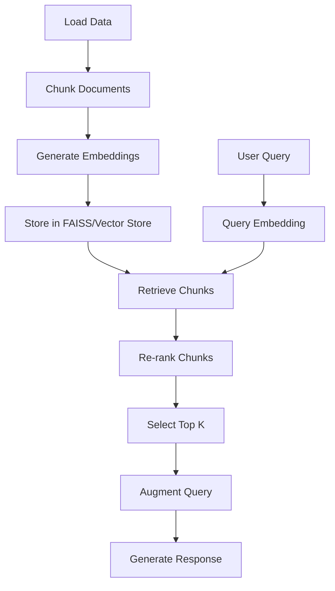

# LlamaIndex

*A tool or framework designed to index (Store) and querry large dataset

## Key Features

- **Document Indexing**: Efficiently index large amounts of data for fast retrieval.
- **Data Connectors**: Seamlessly connect to external databases, APIs, and documents.
- **Retrieval-Augmented Generation (RAG)**: Use documents as context for generating responses or insights.
- **Flexible Pipelines**: Build complex workflows for integrating LLMs and external tools.
- **Modular**: Integrate with popular tools, models, and services like OpenAI, Hugging Face, and more.

## Core Concepts

### 1. **Index**
An **Index** is the main object in LlamaIndex, allowing you to store and retrieve documents. 
It works by converting documents into a format that can be efficiently searched and retrieved by the system.

#### Types of Indexes:
- **List Index**: Store documents as a simple list, great for small-scale applications.
- **Keyword Table Index**: Organize documents based on keywords for faster retrieval.
- **Vector Index**: Converts documents into vector embeddings for similarity-based retrieval.
- **Tree Index**: Creates hierarchical document structures, useful for large-scale document management.

### 2. **Data Connectors**
LlamaIndex can connect to various data sources to ingest and index data for use with LLMs. Common data connectors include:
- **File Connectors**: Connect to local or cloud-based file systems to index document files (e.g., PDFs, text files).
- **Database Connectors**: Integrate with SQL and NoSQL databases for direct access to structured data.
- **API Connectors**: Fetch data from external APIs to augment the information used by the LLM.

### 3. **Query Engine**
Once data is indexed, LlamaIndex provides a query engine to retrieve relevant documents based on user queries. The query engine can work with various types of indexes, including vector-based retrieval for semantic searches.

- **Basic Queries**: Retrieve documents based on exact matches or keyword search.
- **Semantic Queries**: Perform similarity-based queries, using vector embeddings to find contextually relevant documents.

### 4. **Retrieval-Augmented Generation (RAG)**
LlamaIndex supports **RAG workflows**, where the LLM retrieves relevant documents or data points from an index and uses them as context to generate more accurate or insightful responses.

- **Document Retrieval**: Query the index for documents based on semantic relevance.
- **LLM Response Generation**: Use retrieved documents as context to generate responses or summaries.

### 5. **Pipelines**
LlamaIndex allows you to define custom workflows, or pipelines, to automate the process of querying, retrieving, and generating content.

- **Chain Pipelines**: Sequentially link multiple processing steps (e.g., query → retrieval → generation).
- **Parallel Pipelines**: Execute tasks concurrently for efficiency, such as querying multiple indexes in parallel.

## Why LlamaIndex?
- **Efficient Document Indexing**: Handle large datasets with various indexing strategies like **keyword**, **vector**, and **tree-based** indexes for fast retrieval.
- **Seamless Integration with LLMs**: Leverage the power of LLMs for enhanced, contextually aware responses via retrieval-augmented generation.
- **Customizable Querying**: Perform both **semantic** and **keyword-based** searches across indexed documents for more flexible retrieval.
- **Supports RAG Workflows**: Enrich your applications with retrieval-augmented generation capabilities for contextually enriched responses.
- **Open-Source and Actively Maintained**: Continually improved by a growing community of developers and contributors.

## Comparison: Internal Vector Database of LlamaIndex vs FAISS vs Pinecone

| Feature                           | **LlamaIndex Internal Vector Database** | **FAISS**                             | **Pinecone**                          |
|-----------------------------------|------------------------------------------|---------------------------------------|---------------------------------------|
| **Primary Use Case**              | Retrieval-Augmented Generation (RAG) with embedded document vectors. | High-performance similarity search for large datasets, often in ML/NLP tasks. | Scalable, managed vector search service with integrated indexing. |
| **Deployment**                     | Embedded within the LlamaIndex framework, no separate service required. | Can be run locally or on cloud-based systems. Requires manual setup. | Fully managed, cloud-based service. |
| **Ease of Setup**                 | Simple to use within LlamaIndex framework, requires minimal configuration. | Requires some setup and configuration, especially for large-scale applications. | Managed service with easy API integration. Minimal setup needed. |
| **Scalability**                   | Suitable for moderate-sized datasets within LlamaIndex applications. | Excellent scalability for large datasets but requires manual management for scaling. | Highly scalable, handles massive datasets with no manual intervention. |
| **Performance**                   | Optimized for LlamaIndex workflows, good for moderate-scale retrieval. | Extremely fast for similarity search, well-suited for large-scale vector search in research and ML. | Extremely fast, especially for production environments with real-time querying. |
| **Data Types Supported**          | Primarily vector embeddings of text-based data (document-based). | Supports high-dimensional vectors, typically used with embeddings (e.g., from NLP models). | Supports vector embeddings and multi-modal data types (text, images, etc.). |
| **Indexing Method**               | Built-in support for vector-based indexing (using different algorithms like HNSW, IVF). | Uses HNSW (Hierarchical Navigable Small World) graphs, IVFPQ (Inverted File with Product Quantization), etc. | Uses proprietary indexing methods optimized for high-throughput and low-latency search. |
| **Memory Management**             | Stores vectors directly within the LlamaIndex framework, providing basic memory functionality. | Memory management needs to be handled externally (e.g., RAM or disk), with additional setup for persistence. | Fully managed memory with built-in persistence and auto-scaling capabilities. |
| **Query Support**                 | Supports semantic search, where queries are matched to the most relevant document vectors. | Supports nearest neighbor search with various metrics (e.g., L2, cosine similarity). | Supports fast, real-time nearest neighbor search with customizable distance metrics. |
| **Integration**                   | Integrates seamlessly within LlamaIndex. | Widely used in machine learning and data science; can be integrated with Python, TensorFlow, etc. | Offers SDKs for Python, JavaScript, Go, and more, along with REST API. |
| **Cost**                          | No separate cost, integrated within LlamaIndex. | Free for local use; costs depend on infrastructure for large-scale setups. | Paid service with flexible pricing based on usage and scale. |
| **Community & Support**           | Community support within LlamaIndex framework. | Large open-source community; supported by Facebook AI Research (FAIR). | Excellent support with paid plans; strong community and documentation. |
| **Use Case Suitability**          | Best for applications embedded within LlamaIndex, where simplicity and integration are key. | Best for research, ML/NLP tasks, and cases requiring high-performance vector search. | Best for production applications requiring managed, scalable, and fast vector search capabilities. |

---

### ServiceContext
- Configuration manager which bundle all key services and setting that will be use during indexing and query.
- Components: Llm predictor, embedding model, prompt helper, node or chunk parser
- it centralized all at single place which makes this reusable.
- from * import ServiceContext, LLMPredictor


## 🔍 FAISS Indexing Methods Overview

FAISS (Facebook AI Similarity Search) provides multiple indexing strategies for fast and efficient vector similarity search. Here's a comparison of the most commonly used indexing methods:

### 📊 Indexing Methods Comparison

| Index Type | Description | Accuracy | Speed | Memory Usage | Scalability | Best Use Case | Tunable Parameters |
|------------|-------------|----------|-------|---------------|-------------|----------------|----------------------|
| **FLAT** | Brute-force exact search. Compares query with all stored vectors. | ✅ Exact | 🟡 Medium | 🔴 High | ❌ Low | Small datasets, testing | None |
| **IVF** (Inverted File Index) | Vectors are clustered using k-means. Query searches within selected clusters only. | ⚠️ Approximate (depends on `nprobe`) | ✅ Fast | 🟢 Efficient | ✅ Scalable | Medium-large datasets | `nlist`, `nprobe` |
| **HNSW** (Graph-based) | Vectors form a multi-layered proximity graph. Query traverses graph for nearest neighbors. | ✅ High | ✅ Very Fast | 🟡 Medium-High | ✅ Scalable | Real-time, high-accuracy apps | `M`, `efSearch`, `efConstruction` |
| **PQ** (Product Quantization) | Compresses vectors into low-bit codes for memory efficiency. Searches in compressed space. | 🔴 Lower (due to compression) | ✅ Fast | ✅ Very Low | ✅ Highly scalable | Billion-scale search, low-memory environments | `m`, `nbits` |

---

### 🔧 Key Parameter Tips

- `nprobe` (IVF): Number of clusters to search → higher means better accuracy but slower.
- `M` (HNSW): Number of edges per node → more edges = more accuracy, more memory.
- `efSearch` (HNSW): Number of nodes explored during query → higher = better recall.
- `m`, `nbits` (PQ): Controls compression rate → smaller `nbits` = more compression, less accuracy.

---

### ✅ Choosing the Right Index

| Use Case | Recommended Index |
|----------|-------------------|
| Small dataset with high accuracy needed | `IndexFlatL2` (FLAT) |
| Large dataset with good speed and accuracy balance | `IndexIVFFlat` or `IndexIVFPQ` |
| Real-time app with very fast queries | `IndexHNSWFlat` |
| Memory-limited environments with huge datasets | `IndexPQ` or `IndexIVFPQ` |

---

### 📘 Notes

- FLAT search is always exact but becomes very slow for large datasets.
- IVF is scalable but needs tuning (`nlist`, `nprobe`) for better recall.
- HNSW gives high performance and accuracy out-of-the-box, great for production.
- PQ is perfect when storage and memory are limited, but comes at an accuracy cost.

---

## ✂️ Chunking Methods for LLM Context Preparation

When working with large documents, it’s essential to split text into smaller, manageable **chunks** that LLMs can understand and process. Below is a comparison of commonly used chunking methods, especially in frameworks like **LlamaIndex**.

---

### 📊 Chunking Methods Comparison

| Chunking Method | Basis | Context Retention | Speed | Chunk Size Control | Best For | Overlapping Support |
|------------------|-------|--------------------|-------|---------------------|----------|----------------------|
| **Fixed-size Chunking** | Characters or tokens | ❌ Low | ✅ Very Fast | ✅ Yes | Prototyping, small apps | ✅ Optional |
| **Recursive Text Splitting** | Structure (headings, paragraphs, sentences) | ✅ Medium-High | ⚠️ Medium | ⚠️ Limited | Structured documents (blogs, reports) | ✅ Yes |
| **Sentence Window Chunking** | Sentences in overlapping windows | ✅ High | ⚠️ Medium | ❌ Less precise | QA systems, summarization | ✅ Built-in |
| **Token Overlap Chunking** | Tokens with fixed overlap | ✅ High | ⚠️ Medium | ✅ Yes | LLM pipelines, dense data | ✅ Built-in |
| **Markdown-aware Chunking** | Markdown structure (headings, lists) | ✅ Medium | ⚠️ Medium | ⚠️ Moderate | Docs, technical content | ✅ Yes |
| **Semantic Chunking** | Meaning-based segmentation (via embeddings/LLMs) | ✅✅ Very High | ❌ Slow | ❌ No | High-accuracy RAG, semantic search | ⚠️ Experimental |

---

### 🔧 Key Concepts

- **Chunk Size:** Usually defined in terms of **tokens** (e.g., 512 tokens per chunk).
- **Chunk Overlap:** Helps maintain context between chunks, avoids loss at chunk boundaries.
- **Structure-aware Splitting:** Maintains natural document flow by splitting at logical points (e.g., after a paragraph or heading).
- **Semantic Splitting:** Uses LLMs or embeddings to split text at meaningful boundaries — highest quality but computationally expensive.

---

### ✅ Choosing the Right Chunking Method

| Use Case | Recommended Chunking |
|----------|----------------------|
| Quick experiments / simple apps | `Fixed-size Chunking` |
| Blogs, articles, structured docs | `Recursive Text Splitting` |
| QA or RAG pipelines with LLMs | `Sentence Window` or `Token Overlap` |
| Markdown-heavy content | `Markdown-aware Chunking` |
| Precision-critical semantic tasks | `Semantic Chunking` (if compute allows) |

---

### 🧠 Tips for Effective Chunking

- Always balance **chunk size** and **overlap** to avoid token limits and loss of context.
- Overlap is especially important in **conversational AI**, **summarization**, or **semantic search**.
- For most use-cases, a **chunk size of 512–1024 tokens** with **20–100 token overlap** is a good starting point.
- Use `TextSplitter` classes in libraries like LlamaIndex or LangChain to customize chunking.

---

### 📘 Example: RecursiveTextSplitter (LlamaIndex)

```python
from llama_index.text_splitter import SentenceSplitter

splitter = SentenceSplitter(
    chunk_size=512,
    chunk_overlap=64,
    separator=" "
)

chunks = splitter.split_text(long_text)
```

---

Feel free to modify chunking logic based on:
- Your model’s token limit (e.g., 4096, 8192, 32k)
- Document structure and formatting
- Latency/throughput requirements

---
## 🔁 End-to-End RAG Pipeline with LlamaIndex + FAISS

This pipeline outlines the full flow of a Retrieval-Augmented Generation (RAG) system using LlamaIndex and an optional vector store like FAISS.

---

## 🔄 Pipeline Steps

### 1. 📥 Load Textual Data
- Use `DocumentLoaders` (e.g., for `.txt`, `.pdf`, `.docx`, web pages).
- Normalize the text if needed (remove headers, page numbers, etc.).

```python
from llama_index.readers import SimpleDirectoryReader
documents = SimpleDirectoryReader("data/").load_data()
```

---

### 2. ✂️ Chunk the Data
- Choose a **chunking method** (Fixed-size, Recursive, Sentence Window, etc.).
- Configure `chunk_size` and `chunk_overlap` as needed.

```python
from llama_index.text_splitter import SentenceSplitter
splitter = SentenceSplitter(chunk_size=512, chunk_overlap=64)
chunks = splitter.split_documents(documents)
```

---

### 3. 🧠 Generate Embeddings
- Convert chunks into vector representations using an embedding model (e.g., OpenAI, HuggingFace, etc.).

```python
from llama_index.embeddings import HuggingFaceEmbedding
embed_model = HuggingFaceEmbedding(model_name="sentence-transformers/all-MiniLM-L6-v2")
```

---

### 4. 🗃️ Store Chunks in a Vector Store
- Choose between **Internal Datastore** or **External Vector Store** like FAISS.
- Apply appropriate **indexing strategy** (FLAT, IVF, HNSW, etc.).

```python
from llama_index.vector_stores.faiss import FaissVectorStore
vector_store = FaissVectorStore()
index = VectorStoreIndex.from_documents(chunks, vector_store=vector_store)
```

---

### 5. 📨 Receive User Query
- Capture user query from UI, API, or CLI.

```python
query = "What is retrieval-augmented generation?"
```

---

### 6. 🔡 Convert Query into Embedding
- Use the same embedding model as above to convert query into vector format.

```python
query_embedding = embed_model.get_query_embedding(query)
```

---

### 7. 📤 Retrieve Relevant Chunks
- Use similarity search to fetch top-N matching chunks from the vector store.

```python
retriever = index.as_retriever(similarity_top_k=10)
retrieved_nodes = retriever.retrieve(query)
```

---

### 8. 🏅 Re-rank Chunks (Optional)
- Use a **cross-encoder** or **reranking model** to improve ranking accuracy.
- Models: `ms-marco`, `bge-reranker`, `cross-encoder/ms-marco-MiniLM-L-6-v2`, etc.

```python
from llama_index.retrievers import ReRanker
reranker = ReRanker(model="cross-encoder/ms-marco-MiniLM-L-6-v2")
reranked_nodes = reranker.rerank(query, retrieved_nodes)
```

---

### 9. 🎯 Select Top-k Chunks
- Select top-K reranked chunks to feed into the LLM.

```python
top_chunks = reranked_nodes[:5]
```

---

### 10. 🧩 Augment Query with Chunks
- Combine the original query and top chunks to create a **context-rich prompt**.

```python
from llama_index.prompts import PromptHelper
context = "\n".join([node.get_content() for node in top_chunks])
final_prompt = f"Answer the question using the following context:\n\n{context}\n\nQ: {query}\nA:"
```

---

### 11. 🤖 Generate Final Answer
- Use an LLM (OpenAI, Llama 2, Mistral, etc.) to generate the final response.

```python
from llama_index.llms import OpenAI
llm = OpenAI()
response = llm.complete(final_prompt)
print(response)
```

---

## ✅ Summary Flow



---

## 📘 Notes

- Use consistent embedding models for both document and query vectors.
- FAISS indexing (IVF, HNSW, etc.) impacts both speed and accuracy.
- Re-ranking improves precision, especially when top-k similarity search returns noisy results.
- Choose chunking and indexing methods based on your data size and use case.

---

Happy building your RAG pipeline! ⚙️
