Here is a complete Markdown (`.md`) guide on **Activation Functions in Neural Networks**.

# Activation Functions in Neural Networks — Complete Guide

* https://youtu.be/SXrXUqDjICA?si=iEi8kNAdCXM4MuQA
* https://youtu.be/DDBk3ZFNtJc?si=oWqvjV8fRWKDCbYW
* https://youtu.be/qVLQ9Cqm-ec?si=PWaXRCZPgfRKHSMn

# Table of Contents

1. Introduction
2. What is an Activation Function?
3. Why Activation Functions are Important
4. Mathematical Intuition
5. Types of Activation Functions

   * Binary Step
   * Linear
   * Sigmoid
   * Tanh
   * ReLU
   * Leaky ReLU
   * PReLU
   * ELU
   * SELU
   * GELU
   * Swish
   * Softplus
   * Softmax
6. Comparison Table
7. Vanishing and Exploding Gradient Problems
8. Choosing the Right Activation Function
9. Best Practices
10. Interview Questions
11. Conclusion

---

# 1. Introduction

Artificial Neural Networks (ANNs) are inspired by the human brain.
Each neuron receives inputs, processes them, and produces an output.

The **activation function** decides:

* Whether a neuron should activate
* How strongly it should activate
* What output should be passed to the next layer

Without activation functions, neural networks behave like simple linear models and cannot learn complex patterns.

---

# 2. What is an Activation Function?

An activation function is a mathematical function applied to the output of a neuron.

## Basic Neuron Equation

A neuron computes:

[
z = w_1x_1 + w_2x_2 + \dots + b
]

Then activation is applied:

[
a = f(z)
]

Where:

* (x) = input
* (w) = weights
* (b) = bias
* (z) = weighted sum
* (f(z)) = activation function
* (a) = output

---

# 3. Why Activation Functions are Important

## Without Activation Functions

The network becomes only a linear transformation:

[
y = Wx + b
]

Even multiple layers collapse into one linear equation.

This means:

* No deep learning capability
* Cannot solve non-linear problems
* Poor performance

---

## With Activation Functions

Activation functions introduce:

* Non-linearity
* Decision boundaries
* Complex feature learning
* Hierarchical learning

This allows neural networks to:

* Detect images
* Understand language
* Predict complex patterns

---

# 4. Mathematical Intuition

Neural networks learn by:

1. Forward propagation
2. Loss calculation
3. Backpropagation
4. Weight updates

During backpropagation:

[
\frac{dL}{dw}
]

requires derivatives of activation functions.

Therefore activation functions must be:

* Differentiable
* Computationally efficient
* Stable

---

# 5. Types of Activation Functions

---

# 5.1 Sigmoid Function

* Resource: https://machinelearningmastery.com/a-gentle-introduction-to-sigmoid-function/

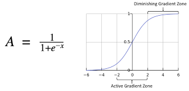

## Output Range

[
(0,1)
]

## Derivative

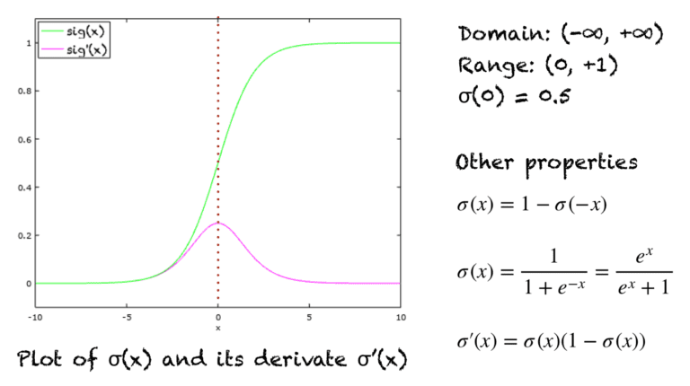

## Derivative Range

[
(0,0.25]
]

---

## Graph Behavior

S-shaped curve.

---

## Advantages

* Probabilistic interpretation
* Smooth gradient

---

## Disadvantages

### 1. Vanishing Gradient

For large values:

[
\sigma'(x) \approx 0
]

Training becomes slow.

### 2. Not Zero-Centered

Outputs always positive.

### 3. Computationally Expensive

Contains exponential calculation.

---

## Use Cases

* Binary classification output layer

---

# 5.2 Tanh Function

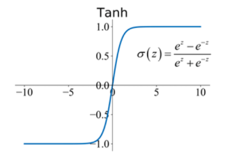

## Output Range

[
(-1,1)
]

## Derivative

[
1-\tanh^2(x)
]

## Derivative Range

[
(0,1]
]

---

## Graph Behavior

Centered S-shaped curve.

---

## Advantages

* Zero-centered
* Better than sigmoid

---

## Disadvantages

* Still suffers vanishing gradient
* Computationally expensive

---

## Use Cases

* RNNs
* Hidden layers in older networks

---

# 5.3 ReLU (Rectified Linear Unit)

* Resource: https://machinelearningmastery.com/rectified-linear-activation-function-for-deep-learning-neural-networks/

## Equation

f(x)=\max(0,x)

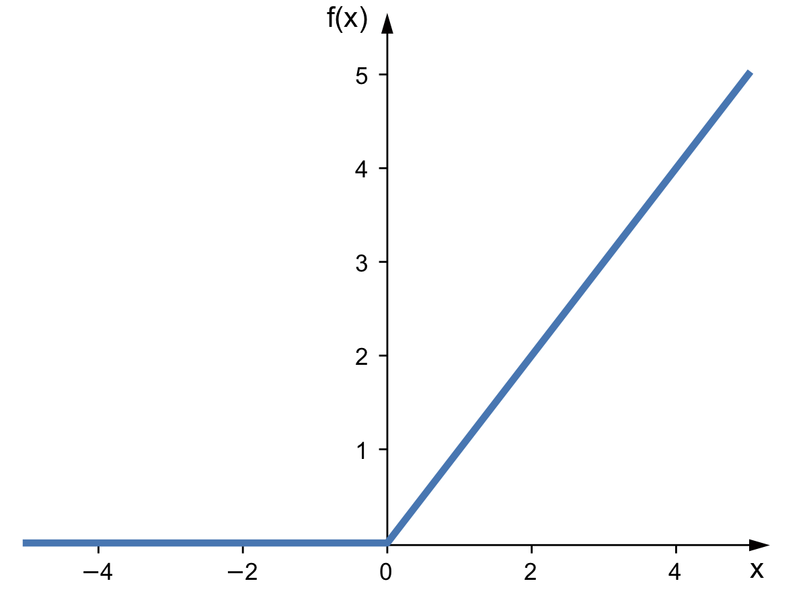
## Output Range

[
[0,\infty)
]

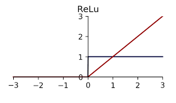

## Derivative Range

[
0 \text{ or } 1
]

---

## Graph Behavior

* Zero for negative values
* Linear for positive values

---

## Advantages

### 1. Computationally Fast

Very efficient.

### 2. Reduces Vanishing Gradient

Gradient remains 1 for positive inputs.

### 3. Sparse Activation

Negative neurons become inactive.

---

## Disadvantages

### Dying ReLU Problem

If neuron output becomes negative forever:

[
f(x)=0
]

Neuron stops learning.

---

## Use Cases

* Most hidden layers in CNNs and DNNs

---

# 5.4 Leaky ReLU

## Equation

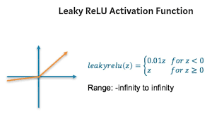

## Output Range

[
(-\infty,\infty)
]

## Derivative Range

[
0.01 \text{ or } 1
]

---

## Advantages

* Fixes dying ReLU
* Small gradient for negative values

---

## Disadvantages

* Slope parameter manually chosen

---

## Use Cases

* Deep CNNs

---

# 5.5 PReLU (Parametric ReLU)

## Equation

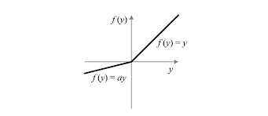
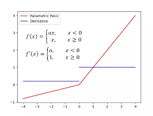

---

## Advantages

* Learns optimal negative slope

---

## Disadvantages

* Slightly more computation
* Risk of overfitting

---

# 5.6 ELU (Exponential Linear Unit)

## Equation

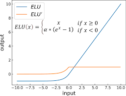

## Output Range

[
(-\alpha,\infty)
]

---

## Advantages

* Reduces bias shift
* Negative outputs improve learning

---

## Disadvantages

* More computational expensive than ReLU

---

# 5.7 GELU (Gaussian Error Linear Unit)

## Equation

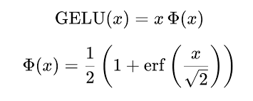
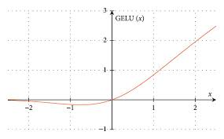

Approximation:

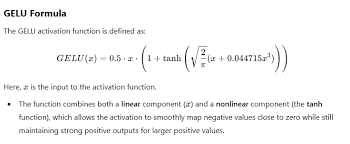

---

## Advantages

* Smooth activation
* Better performance in transformers

---

## Disadvantages

* Computationally heavy

---

## Use Cases

* Transformers
* BERT
* GPT models

---

# 5.8 Swish Function

## Equation
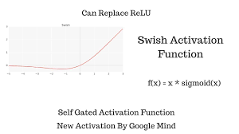

f(x) =  x * sigmoid(x)

---

## Derivative

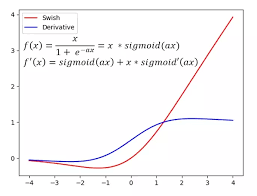

---

## Output Range

[
(-0.278,\infty)
]

---

## Advantages

* Smooth
* Outperforms ReLU in some tasks

---

## Disadvantages

* More computation

---

# 5.9 Softmax Function

## Equation

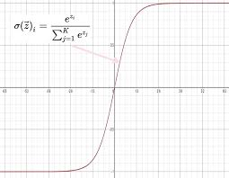

## Output Range

[
(0,1)
]

Sum of outputs:

sum of all outputs = 1

---

## Advantages

* Produces probability distribution

---

## Disadvantages

* Sensitive to large values

---

## Use Cases

* Multi-class classification output layer

---

# 6. Comparison Table

| Function    | Range  | Derivative Range | Main Problem          | Best Use              |
| ----------- | ------ | ---------------- | --------------------- | --------------------- |
| Sigmoid     | (0,1)  | (0,0.25]         | Vanishing gradient    | Binary output         |
| Tanh        | (-1,1) | (0,1]            | Vanishing gradient    | RNN                   |
| ReLU        | [0,∞)  | 0 or 1           | Dying ReLU            | Hidden layers         |
| Leaky ReLU  | (-∞,∞) | 0.01 or 1        | Manual slope          | CNNs                  |
| PReLU       | (-∞,∞) | Learnable        | Overfitting           | Deep nets             |
| ELU         | (-α,∞) | Positive         | Expensive             | Faster learning       |
| GELU        | Smooth | Smooth           | Heavy compute         | Transformers          |
| Swish       | Smooth | Smooth           | Expensive             | Advanced CNNs         |
| Softmax     | (0,1)  | Complex          | Numerical instability | Multi-class output    |

---

# 7. Vanishing and Exploding Gradient Problems

---

# Vanishing Gradient

During backpropagation:

[
\frac{dL}{dw}
]

becomes extremely small.

Result:

* Slow learning
* Early layers stop learning

Common in:

* Sigmoid
* Tanh

---

# Exploding Gradient

Gradients become huge.

Result:

* Unstable training
* Overflow errors

Solutions:

* Gradient clipping
* Better initialization
* ReLU variants

---

# 8. Choosing the Right Activation Function

## Hidden Layers

Usually:

* ReLU
* Leaky ReLU
* GELU

---

## Output Layer

### Binary Classification

Use:

* Sigmoid

### Multi-class Classification

Use:

* Softmax

### Regression

Use:

* Linear

---

# 9. Best Practices

## Recommended Defaults

| Scenario                   | Recommended Function |
| -------------------------- | -------------------- |
| Deep CNN                   | ReLU                 |
| Avoid dead neurons         | Leaky ReLU           |
| Transformers               | GELU                 |
| Binary classification      | Sigmoid              |
| Multi-class classification | Softmax              |
| Regression                 | Linear               |

---

# 10. Interview Questions

## Q1. Why do we need activation functions?

To introduce non-linearity into neural networks.

---

## Q2. Why is ReLU popular?

* Fast
* Simple
* Reduces vanishing gradient

---

## Q3. What is dying ReLU?

Neuron outputs zero forever and stops learning.

---

## Q4. Why not use sigmoid everywhere?

Because of vanishing gradients and slow learning.

---

## Q5. Why is Softmax used in classification?

It converts outputs into probabilities.

---

# 11. Conclusion

Activation functions are the heart of deep learning.

They:

* Introduce non-linearity
* Enable complex learning
* Control gradient flow
* Affect convergence speed
* Influence model performance

Modern deep learning heavily relies on:

* ReLU family
* GELU
* Softmax

Choosing the correct activation function can significantly improve:

* Accuracy
* Stability
* Training speed

---

# Final Summary

| Function   | Key Strength          | Key Weakness          |
| ---------- | --------------------- | --------------------- |
| Sigmoid    | Probabilities         | Vanishing gradients   |
| Tanh       | Zero-centered         | Vanishing gradients   |
| ReLU       | Fast and effective    | Dead neurons          |
| Leaky ReLU | Fixes ReLU issue      | Manual tuning         |
| GELU       | Best for transformers | Expensive             |
| Softmax    | Probability outputs   | Numerical sensitivity |

---
