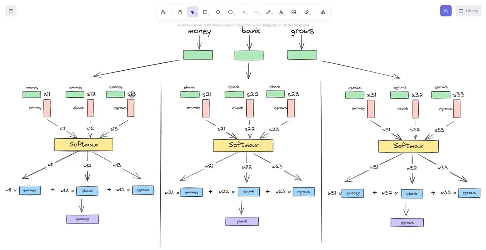
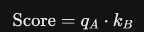
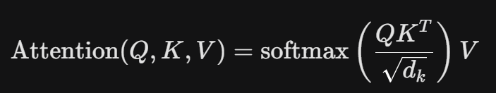
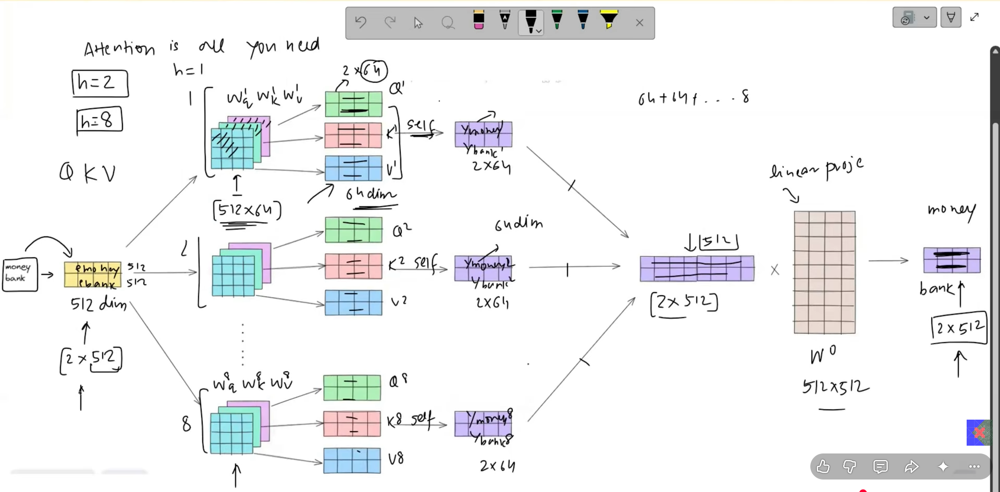

# Attention Mechanism
---

# Self Attention: A method to convert static embeddings into contextual aware embeddings.
## 1. Intro & The Core Concept of Self-Attention

In traditional Natural Language Processing (NLP) models (like standard Recurrent Neural Networks), processing text sequence-by-sequence often leads to a loss of context, especially over long distances. **Self-Attention** is the foundational mechanism that solves this by allowing a model to look at other words in the input sequence to get a better encoding for the current word.

* **Definition:** A mechanism that enables a model to weigh the importance of different words in a sequence relative to each other.
* **The Goal:** To dynamically capture "long-range dependencies" and contextual relationships in data without relying on sequential processing.

---

## 2. The Problem of "Average Meaning"

Before diving into how Self-Attention works, it is crucial to understand the limitation it directly addresses in older vector embedding techniques (like Word2Vec or GloVe):

* **Static Embeddings:** In older architectures, a word like *"bank"* has a single, fixed vector representation.
* **The Issue:** If you say *"I am going to the bank to deposit money"* versus *"I am sitting on the river bank,"* a static model provides the exact same mathematical vector for *"bank"* in both sentences. This results in an **"average meaning"** that fails to capture polysemy (words with multiple meanings).
* **The Self-Attention Fix:** Instead of assigning a fixed meaning, Self-Attention look at the surrounding context words (like *"deposit/money"* vs. *"river"*) and **dynamically recalculates** the word vector based on its environment.

---

Note: 
* Speed is one advantage of this method as all key,querry,value can be calculated parallely and attention score also can calcualted parallely.
* No tuning parameter is available.
* It is helpful in General contextual understanding. it may fail on task specific like translation of proverbs into hindi.
---

## 3. How Self-Attention Works (The Mechanism)

The video breaks down how a sentence is mathematically transformed to inject context. While the underlying math relies on Linear Algebra, the process follows these conceptual steps:

### Step 1: Input Embeddings

Each word in the input sequence is converted into a continuous vector (an embedding).

* Let's say the input is a sequence of vectors: $X = [x_1, x_2, ..., x_n]$.

### Step 2: Creating Queries, Keys, and Values

For every input vector $x_i$, the model projects it into three distinct spaces by multiplying it with three trained weight matrices ($W_Q, W_K, W_V$):

* **Query ($Q$):** "What am I looking for?" (The current word asking about its relationship to others).
* **Key ($K$):** "What do I contain?" (The label or index of every word in the sentence).
* **Value ($V$):** "What is my actual content?" (The actual information the word carries).

### Step 3: Calculating Attention Scores

To see how much focus word $A$ should place on word $B$, the model takes the Dot Product of the Query of word $A$ ($q_A$) and the Key of word $B$ ($k_B$).

### Step 4: Scaling and Softmax

1. **Scaling:** The scores are divided by the square root of the dimension of the key vectors ($\sqrt{d_k}$). This prevents the dot products from growing excessively large, which can cause gradient issues during training.
* dimensionality of all key, querry and value will be same equal to $$ d_k $$.
* High dimensional vector's dot product have high variance. High vairance means some numbers is very large cmpared to others. so, if we apply softmax over such numbers, bydefualt it will map high numbers to high probablities and low numbers to low probabilities. Hence, during BPT, gradient will be vanish for low probablities number and training process will focus only large numbers.
* Variation of product of any two matrix with same dimension 'd' is equals to d. If the variance is $d_k$, it means the standard deviation is $\sqrt{d_k}$.By dividing the dot product by its standard deviation ($\sqrt{d_k}$), we mathematically force the variance of the result back down to 1. 
2. **Softmax:** A Softmax function is applied to turn these scores into probabilities (values between 0 and 1 that sum up to 1). This tells us exactly what percentage of attention a word should pay to every other word.

### Step 5: Weighted Sum (The Final Output)

Finally, the attention probabilities are multiplied by the corresponding **Value ($V$)** vectors. Summing these up gives the final, context-aware vector representation for that specific word.

---

## Summary of Benefits

* **Contextual Awareness:** Words change their mathematical meaning depending on the sentence they are in.
* **Parallelization:** Unlike RNNs which process word-by-word, Self-Attention allows the entire sentence to be processed simultaneously, making training significantly faster on modern hardware (GPUs).
* **Long-Range Connections:** A word at the very beginning of a long paragraph can easily "attend" to a word at the very end without information leaking or degrading over time.

---

# Multi head attention

## Core Concept: Why Multi-Head Attention?

While standard **Self-Attention** allows a model to look at other words in a sentence to understand the context of a specific word, it has a major limitation: it only focuses on **one relationship or perspective at a time** (a single attention distribution).

**Multi-Head Attention (MHA)** solves this by splitting the attention mechanism into multiple "heads" running in parallel. This allows the model to jointly attend to information from different representation subspaces at different positions.

---

## Key Comparisons: Self-Attention vs. Multi-Head Attention

| Feature | Single-Head Self-Attention | Multi-Head Attention |
| --- | --- | --- |
| **Perspectives** | Captures only one type of relationship at a time. | Captures multiple relationships simultaneously (e.g., syntactic, semantic, long-range). |
| **Output** | Generates a single attention matrix. | Generates multiple attention matrices that are combined. |
| **Information** | Risk of the model focusing too much on its own position. | Encourages the model to focus on diverse parts of the sequence. |

---

## How It Works (Step-by-Step)

### 1. Linear Projection

Instead of performing a single attention function with the full dimensionality of the queries, keys, and values ($d_{model}$), the input embeddings are linearly projected $h$ times (where $h$ is the number of heads).

* **Queries ($Q$)**, **Keys ($K$)**, and **Values ($V$)** are split into lower-dimensional spaces:

$$d_k = d_v = d_model/h$$

* *Example:* If $d_model = 512$ and $h = 8$, each head operates on a dimensionality of $64$.

### 2. Parallel Attention (Scaled Dot-Product)

Each of the $h$ heads independently performs **Scaled Dot-Product Attention** in parallel:

Each head can focus on something different (e.g., Head 1 tracks *who* did the action, Head 2 tracks *when* it happened, Head 3 handles structural/grammar rules).

### 3. Concat and Project

* **Concatenation:** The outputs from all $h$ attention heads are glued together side-by-side.
* **Final Linear Layer:** The concatenated output is multiplied by a final weight matrix ($W^O$) to project it back into the original $d_{model}$ dimensions so it can be passed smoothly to the next layer (like the Feed-Forward Network).

---

## Summary of Benefits

* **Diverse Representations:** Prevents the model from getting "tunnel vision" on just one aspect of a sentence.
* **Computational Efficiency:** Because the total dimensionality is split across the heads, the total computational cost is similar to full-dimensionality single-head attention, but with much greater expressive power.

---

# Masked Attention

---

## 1. Core Architecture Blueprint

Transformer ke do main parts hote hain jo aapas mein team-work karte hain:

1. **Encoder (The Reader):** Pura input sentence (English) ek sath padhta hai aur uska full context samajhta hai. Isme **No Masking** hoti hai (Bi-directional).
2. **Decoder (The Writer):** Output sentence (Hindi) ek-ek karke generate karta hai. Isme **Masked Attention** hoti hai taaki ye aage ka answer na dekh sake.
3. **Cross-Attention Bridge:** Decoder ko Encoder se jodta hai, taaki likhte waqt model sahi English word par focus kar sake.

---

## 2. Training Phase (Fast & Parallel)

Training ke waqt hamare paas Input (English) aur Target (Hindi) dono pehle se hote hain. Is phase ko fast banane ke liye hum **Teacher Forcing** use karte hain.

### Step-by-Step Workflow:

* **Encoder Input:** Pura English sentence ek sath diya jata hai $\rightarrow$ `"The cat sat"`.
* *Action:* Encoder bina kisi restriction ke sabhi words ko aapas mein attend karwata hai aur har word ka ek powerful **Contextual Embedding Matrix** bana kar ready rakhta hai.

* **Decoder Input:** Pura Hindi sentence (Shifted Right) ek sath diya jata hai $\rightarrow$ `[BOS] बिल्ली बैठी थी`.
* *Action 1 (Masked Attention):* Decoder is pure sentence ko ek sath process karta hai, lekin **Causal Mask ($-\infty$ trick)** ki wajah se:
* `[BOS]` token aage ke Hindi words nahi dekh sakta.
* `[BOS] बिल्ली` ke waqt model `"बैठी थी"` nahi dekh sakta.

* *Action 2 (Cross Attention):* Decoder ka har step ab Encoder ke ready-made Contextual Matrix se sawal-jawab karta hai (*"Mujhe `[BOS] बिल्ली` ke baad kya likhna chahiye?"*).

* **Parallel Loss & Learning:**
* Model ek hi baar mein saare tokens ke liye predictions nikalta hai.
* In predictions ko actual Hindi words se compare karke **Cross-Entropy Loss** nikala jata hai.
* Gradients piche aate hain aur weights update hote hain. **Masking ki wajah se gradient kabhi future se past mein leak nahi hota.**

---

## 3. Testing / Inference Phase (Sequential & Loop)

Testing ke waqt hamare paas target Hindi sentence nahi hota. Model ko ek-ek word khud generate karna padta hai (Autoregressive process).

### Step-by-Step Workflow:

* **Step 1: Encoder Context Generation (Sirf ek baar chalta hai)**
* Input diya: `"The cat sat"`
* Encoder iska Context Matrix bana kar freeze kar deta hai. Ab isse baar-baar chalane ki zaroorat nahi hai.

* **Step 2: Decoder Kickstart (Loop Starts)**
* Decoder ko sirf ek token diya jata hai: `[BOS]` (Beginning of Sentence).
* Masked Attention lagta hai (Yahan mask ka koi asar nahi hota kyunki single token hi hai).
* Cross-Attention chalta hai Encoder ke matrix ke sath.
* **Output:** Model pehla word predict karta hai $\rightarrow$ `"बिल्ली"`.

* **Step 3: Appending the Output**
* Ab Decoder ka naya input banta hai: `[BOS] बिल्ली`.
* Masked Attention ab ensure karta hai ki `"बिल्ली"` piche `[BOS]` ko dekh sake.
* Cross-Attention firse chalta hai English context ke sath.
* **Output:** Model agla word predict karta hai $\rightarrow$ `"बैठी"`.

* **Step 4: Stopping Condition**
* Ye loop tab tak chalta rehta hai jab tak Decoder output mein `[EOS]` (End of Sentence) token generate nahi kar deta.

---

## 4. Quick Summary Checklist

| Feature | Training Phase | Testing (Inference) Phase |
| --- | --- | --- |
| **Encoder Run** | Ek baar (Parallel) | Ek baar (Freeze ho jata hai) |
| **Decoder Run** | **Parallel** (Pura sentence ek sath) | **Sequential** (Ek-ek word karke loop mein) |
| **Masking Role** | Cheating rokna (Future hide karna) | Future hota hi nahi hai (Sirf past token handling) |
| **Speed** | Extremely Fast (GPU friendly) | Slow (Kyunki word-by-word loop chalta hai) |

---

# Cross Attention
At its core, **Cross-Attention** is the mechanism that allows two different sequences to talk to each other. While *Self-Attention* looks at different words within the *same* sequence to understand context, Cross-Attention combines **two different sources of information**—such as a text prompt and an image, or a Spanish sentence and its English translation.

It is the engine behind Encoder-Decoder transformers (like T5 or BART) and text-to-image models (like Stable Diffusion).

Here is a detailed, step-by-step breakdown of how it works.

---

## 1. The Core Concept: Queries, Keys, and Values

To understand Cross-Attention, you have to look at where the **Queries ($Q$)**, **Keys ($K$)**, and **Values ($V$)** come from.

In Self-Attention, all three come from the exact same source. In **Cross-Attention**, they are split between a **Target sequence** and a **Source sequence**:

* **Queries ($Q$):** Generated from the *Target* sequence (the sequence currently being generated or processed).
* **Keys ($K$):** Generated from the *Source* sequence (the context or conditioning input).
* **Values ($V$):** Generated from the *Source* sequence (the actual content/features of the context).

> 💡 **The Analogy:** Think of it like a search engine. You type a **Query** (Target). The search engine looks at the **Keys** (video titles/tags of the Source) to find a match. Once it finds the best match, it retrieves the **Values** (the actual video content of the Source).

---

## 2. Step-by-Step Mathematical Walkthrough

Let’s say we are translating text. The Encoder has processed the source sentence, and the Decoder is generating the target sentence.

### Step 1: Linear Projections

We have two hidden states: $H_{target}$ (from the decoder) and $H_{source}$ (from the encoder). We multiply them by trained weight matrices ($W_Q, W_K, W_V$) to get our matrices:

$$Q = H_{target} \cdot W_Q$$

$$K = H_{source} \cdot W_K$$

$$V = H_{source} \cdot W_V$$

*Note: $K$ and $V$ must always have the same sequence length ($L_{source}$), while $Q$ has its own sequence length ($L_{target}$).*

### Step 2: Calculating Attention Scores (Dot-Product)

We calculate how much every element in the target sequence should pay attention to every element in the source sequence. We do this by taking the dot product of $Q$ and the transpose of $K$:

$$\text{Scores} = QK^T$$

If $Q$ has shape $(L_{target}, d)$ and $K^T$ has shape $(d, L_{source})$, the resulting matrix has the shape **$(L_{target}, L_{source})$**. This gives us a matrix of raw similarity scores.

### Step 3: Scaling and Softmax

To prevent the gradients from vanishing or exploding during training, we scale the scores by the square root of the head dimension ($d_k$). Then, we apply a **Softmax** function across the source dimension. This converts the raw scores into probabilities that add up to 1.

$$\text{Attention Weights} = \text{softmax}\left(\frac{QK^T}{\sqrt{d_k}}\right)$$

Each row in this matrix represents a token in the target sequence, and it shows exactly how much weight (attention) it is giving to every token in the source sequence.

### Step 4: Weighting the Values

Finally, we multiply these attention weights by the $V$ (Value) matrix.

$$\text{Output} = \text{softmax}\left(\frac{QK^T}{\sqrt{d_k}}\right)V$$

This extracts a weighted blend of the source information, tailored specifically to what the target sequence currently needs.

---

## 3. Self-Attention vs. Cross-Attention

| Feature | Self-Attention | Cross-Attention |
| --- | --- | --- |
| **Inputs** | One single sequence | Two different sequences |
| **Source of $Q$** | Input Sequence A | Target Sequence B |
| **Source of $K, V$** | Input Sequence A | Source Sequence A |
| **Matrix Shape ($QK^T$)** | Square $(L_{target} \times L_{target})$ | Rectangular $(L_{target} \times L_{source})$ |
| **Primary Use Case** | Understanding internal context | Connecting or translating two domains |

---

## 4. Real-World Use Cases

* **Machine Translation (Transformers):** While generating an English word, the decoder uses $Q$ to ask the encoder's $K$ and $V$, *"Which of these French words should I be focusing on right now?"*
* **Text-to-Image (Stable Diffusion):** The generation process starts with random image noise (Target $\rightarrow Q$). The text prompt you type acts as the conditioning context (Source $\rightarrow K, V$). Cross-attention allows the pixels to constantly check the text prompt to ensure the image being denoised matches your description.

