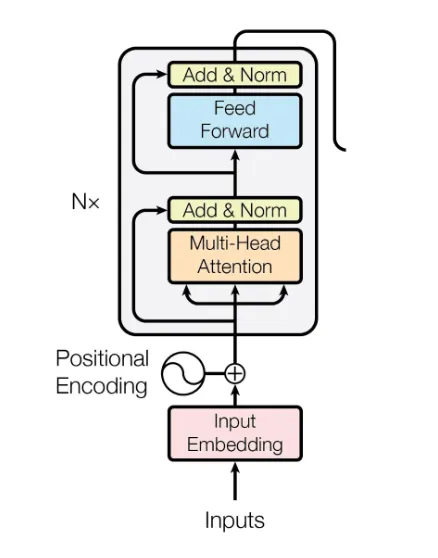
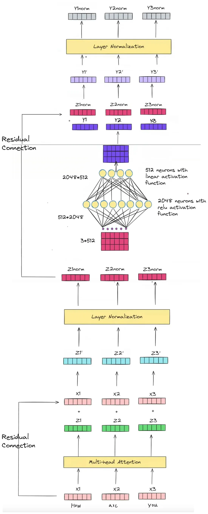

---
# Transformer Architecture | Part 1 Encoder Architecture

---



## 🧭 Overview of the Transformer

At its highest level, the Transformer architecture can be conceptualized as a system divided into two core components:

1. **The Encoder (Left side):** Responsible for understanding the input text and capturing its contextual meaning.
2. **The Decoder (Right side):** Responsible for generating the target output (e.g., translation, text generation) based on the encoder's representations.

*Note: This specific breakdown focuses entirely on the **Input Block** and the **Encoder Block**.*

---

## 1. The Input Block (Pre-processing Stage)

Before a sentence is fed into the actual Encoder layers, it must undergo three crucial transformation steps. Because machines cannot process raw text, it must be converted into numerical vectors.

### A. Tokenization

* **What it does:** Splitting the raw input sentence into smaller units called tokens (typically word-level or sub-word level).
* **Example:** The sentence `"How are you?"` gets split into tokens: `["How", "are", "you"]`.

### B. Text Embedding (Vectorization)

* **What it does:** Converts each token into a dense numerical vector using a lookup table (Word Embeddings).
* **Dimensionality:** In the standard Transformer architecture, every single word is mapped to a vector of **512 dimensions** ($d_{model} = 512$).
* **Example:** `How` $\rightarrow$ $[v_1, v_2, ..., v_{512}]$

### C. Positional Encoding

* **The Problem:** Unlike older recurrent architectures (RNNs/LSTMs) that process text sequentially word-by-word, Transformers process all words in a sentence **simultaneously (in parallel)**. Because of this, the network inherently lacks a sense of word order or positions.
* **The Solution:** **Positional Encoding** generates a unique 512-dimensional vector for each position index in the sentence.
* **The Math/Action:** This positional vector is mathematically **added** to the original word embedding vector.

$$\text{Final Input Vector } (X) = \text{Word Embedding} + \text{Positional Encoding}$$


* This yields position-aware embeddings ($X_1, X_2, X_3$) while strictly maintaining the 512-dimensional structure.

---

## 2. Inside the Encoder Block

Once the input vectors ($X$) are prepared, they enter the Encoder. An encoder consists of a stack of multiple identical layers (typically 6 layers). Each layer contains two primary sub-layers:

### A. Multi-Head Attention (The Core Engine)

Instead of relying on just one attention viewpoint, the model splits its attention into multiple "heads" running in parallel.

* **Self-Attention Mechanism:** Allows the model to look at other words in the input sentence to gain a better context for the current word.
* *Context Example:* Consider the word **"bank"** in two sentences: *"The bank approved the loan"* vs. *"He sat by the river bank"*. Initially, the static embedding for "bank" is identical. Self-attention dynamically alters the vector based on surrounding words (like "loan" or "river") to capture the exact contextual meaning.


* **Multi-Head Execution:** By using multiple attention heads simultaneously, the model can focus on different aspects of the sentence structure at once (e.g., syntax, tense, subject-object relationships).
* **Output:** The output of this block is a set of context-enriched vectors ($Z_1, Z_2, Z_3$), still maintaining the **512-dimension** limit.

### B. Add & Normalize (Residual Connections)

To ensure smooth gradient flow during training and prevent the vanishing gradient problem, the architecture introduces **Residual Connections**.

1. **Add:** The original input vector ($X$) is added back to the attention output ($Z$).

$$\text{Output} = Z + X$$


2. **Normalize:** **Layer Normalization** is applied to stabilize the inputs across the network features, resulting in normalized vectors ($Z_{\text{norm}}$).

### C. Feed-Forward Network (FFN)

After the attention features are normalized, they are passed through a fully connected Feed-Forward Network that is applied to each position identically and independently.

* It consists of a two-layer linear transformation:
1. **Layer 1:** Expands the dimensionality from 512 to **2048 neurons**, utilizing a **ReLU** (or GeLU in variants) activation function.
2. **Layer 2:** Compresses the dimensionality back down from 2048 to **512 neurons** using a linear activation function.


### D. Second "Add & Normalize"

The output of the Feed-Forward Network goes through one final residual addition and layer normalization step before being passed out of the current encoder block.

---

## 🔁 Summary of the Data Flow

```text
[Input Text] 
     │
     ▼
[Tokenization] ──> [Word Embedding (512)] + [Positional Encoding]
     │
     ▼
┌────────────────────────────────────────────────────────┐
│                   ENCODER BLOCK                        │
│                                                        │
│  [Multi-Head Attention] ────────────────┐              │
│            │                             │ (Residual)  │
│            ▼                             │             │
│     [Add & Normalize] <──────────────────┘             │
│            │                                           │
│            ▼                                           │
│  [Feed-Forward Network (512 -> 2048 -> 512)] ──┐       │
│            │                                   │(Resid.)│
│            ▼                                   │       │
│     [Add & Normalize] <────────────────────────┘       │
└────────────────────────────────────────────────────────┘
     │
     ▼
(To the next Encoder Block / Decoder)

```

## 💡 Key Takeaway

Throughout the entire encoder pipeline, despite all the structural warping, matrix multiplications, and expansions inside the feed-forward network, the vector representation sizes are strictly maintained at **512 dimensions** at the boundary of every sub-layer. This modularity allows encoder blocks to be stacked seamlessly on top of one another.

---

Here is why **Residual Connections** and **Feed-Forward Networks (FFN)** are absolutely critical to the Transformer Encoder, and what would happen if we removed them.

---

## 1. Why do we need Residual Connections (Add & Norm)?

In the original Transformer paper, every sub-layer (Attention and FFN) is wrapped in a **Residual Connection** (the "Add" step), followed by **Layer Normalization**.

### A. Preventing the Vanishing Gradient Problem

The Transformer Encoder stacks multiple identical layers (typically 6, but massive models like GPT or BERT stack dozens). As a network gets deeper, gradients (the signals used to update weights during training) have to flow backward through all these layers.

* **Without Residuals:** The gradient gets multiplied by fractions at every single layer, shrinking exponentially until it becomes zero (vanishes) before reaching the earliest layers. The model ceases to learn.
* **With Residuals:** The "Add" step creates a **highway** that allows the gradient to flow back directly to earlier layers without being altered by the complex attention or FFN math.

### B. Preserving Information (The "Safety Net")

Self-attention modifies word vectors based on context. However, sometimes the attention mechanism might over-focus on a specific context and accidentally distort or "forget" the original core meaning of the word. The residual connection explicitly adds the original input back to the modified output, ensuring the model never loses track of the initial information.

---

## 2. Why do we need the Feed-Forward Network (FFN)?

If Multi-Head Attention is so powerful at capturing context, why do we need a Feed-Forward Network immediately after it?

### A. Self-Attention Only Moves Information; FFN Processes It

* **The Role of Attention:** Attention is purely a mechanism for words to *talk* to each other. It passes information sideways across the sentence (e.g., connecting the word "bank" to "river"). However, it doesn't actually perform complex mathematical transformations on the features themselves.
* **The Role of FFN:** Once the attention layer collects all the contextual data, the FFN acts as a local "processing brain" for each individual word token. It takes that context and computes what it actually *means*. It is applied to each word position independently.

### B. Introducing Non-Linearity to Learn Complex Patterns

If you only stack attention layers, the model remains purely linear. Linear models cannot learn highly complex, non-linear relationships in language (like sarcasm, idioms, or intricate logic).

* The FFN expands the data from **512 dimensions to 2048 dimensions**, applies a **non-linear activation function** (like ReLU or GeLU), and compresses it back to 512.
* This expansion-compression act forces the model to extract and memorize deeper patterns and abstract concepts.

---

## 📊 Summary: How they work together

Think of the Encoder block as a highly efficient corporate team:

1. **Multi-Head Attention:** The team members *communicate* and share information with each other to understand the context of the project.
2. **Residual Connection 1:** They make sure they don't forget the original project guidelines.
3. **Feed-Forward Network:** Each team member goes back to their own desk and does deep, *individual analytical thinking* based on the information shared.
4. **Residual Connection 2:** They double-check their final analysis against what they started with before passing it to the next department.

---
# Full Encoder

